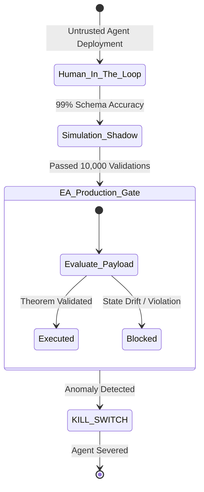

# RFC 0001: Execution Authority Protocol for Agentic AI

**Network Working Group**  
**Request for Comments:** 0001  
**Category:** Protocol Standards  
**Author:** Exogram Protocol Team ([exogram.ai](https://exogram.ai))  
**Date:** April 2026

---

## 1. Abstract

This document defines the **Execution Authority (EA) Protocol**, an architectural networking layer explicitly designed to mitigate the inherent non-determinism of Agentic AI systems interacting with production endpoints. As Large Language Models (LLMs) scale, they utilize probabilistic stochastic inference to output JSON payloads intended for tool execution. Direct integration of these payloads to deterministic APIs exposes enterprise systems to severe, mathematically unavoidable vulnerabilities. 

The Execution Authority protocol introduces a rigid, mathematically proven interception boundary. Situated squarely between the Orchestration Layer (e.g., LangChain) and the Target Environment, the EA guarantees 100% deterministic logic gating, cryptographic payload authorization, and absolute loop prevention on all executed mutation requests.

---

## 2. Conventions and Terminology

The key words "MUST", "MUST NOT", "REQUIRED", "SHALL", "SHALL NOT", "SHOULD", "SHOULD NOT", "RECOMMENDED",  "MAY", and "OPTIONAL" in this document are to be interpreted as described in [RFC 2119](https://tools.ietf.org/html/rfc2119).

- **Execution Token ($C_{tok}$):** A cryptographic JWT (JSON Web Token) binding a specific tool payload to a specific validated state hash.
- **Intent Dependencies ($\Gamma$):** The complete set of required subgraph edges a payload must satisfy to be deemed logically safe.
- **State Drift:** The condition where the environment state changes between initial retrieval ($T_0$) and execution request ($T_1$).
- **EA Node:** Any network proxy or embedded SDK implementing this protocol.

---

## 3. Reference Architecture: The 4 Layers of AI Agent Autonomy

The Generative AI stack has organically matured into three standardized layers. The Exogram Protocol officially formalizes the required **Fourth Layer** (`AI Agent Firewall`) to achieve safe, unsupervised system autonomy. Each major AI vendor currently suffers from a fundamental execution gap that only an Execution Authority API can mathematically bridge.

### Layer 1: The Intelligence Layer (Stochastic Generation)
- **Role:** Semantics, linguistic translation, and reasoning approximations $\mathcal{L}(x)$.
- **Components:** Anthropic Claude, OpenAI o1, Meta Llama, Google Gemini.
- **The Execution Gap:** This layer operates purely probabilistically. It relies on temperature generation algorithms. It MUST NOT be trusted with strict Boolean logic execution due to inherent token generation variance and hallucination. 
- **The Exogram API Remedy:** By routing proposed payloads to Exogram, intelligence models are decoupled from physical mutations. Exogram mathematically verifies the model's intent before interacting with API infrastructure.

### Layer 2: AI Agent Memory (State Retrieval)
- **Role:** Contextual grounding utilizing mapping $V_{query} \to \{C_1, C_2 \dots C_k\}$.
- **Components:** Pinecone, Milvus, Databricks, Zep, Mem0.
- **The Execution Gap:** Retrieves unbounded probabilistic data based on similarity search mechanics. By definition, **AI Agent Memory** engines are susceptible to context poisoning and semantic drift.
- **The Exogram API Remedy:** Cryptographically hashes the retrieved memory state into an immutable signature. If the memory retrieves corrupted injected data, the intent graph diverges, and the Exogram Firewall drops the tool payload.

### Layer 3: The Orchestration Layer (Routing & Cyclic Loops)
- **Role:** Finite State Machine management and execution routing $O_{state} \to O_{next\_state}$.
- **Components:** LangChain, CrewAI, AutoGen, Letta.
- **The Execution Gap:** Orchestrators execute Python/JS instruction loops dictated by probabilistic agents. It cannot natively prevent infinite death-loops if the agent hallucinates.
- **The Exogram API Remedy:** Provides **Deterministic AI Guardrails** at the network edge. Exogram tracks deterministic agent identities and issues hard `HTTP 409 Conflict` interventions to instantly sever runaway orchestration loops.

### Layer 4: The Execution Authority Layer (AI Agent Firewall)
- **Role:** The immutable, mathematically defined security gate $\mathbf{Execute}(P)$.
- **Components:** Exogram Protocol EA infrastructure implementations.
- **Protocol Bounds:** An absolute **AI Agent Firewall** isolated from Layers 1-3. It operates natively in physical infrastructure routing, prioritizing network security logic to validate outputs.

---

## 4. Threat Model and The Vulnerability Vectors

Routing `Tool Calls -> Target` blindly from Layer 3 exposes Target Environments to three primary vectors of attack.

### 4.1 Semantic Hallucination (Syntactic Correctness $\neq$ Intent Validity)
Zod/Pydantic validation layers only check data geometry. If an Orchestration Layer requests a database drop tool, and the Agent fills out the schema (`{"table": "users", "force": true}`), the JSON is completely valid. Syntactic execution leads to critical data loss.

### 4.2 Geometric Proof of Context Poisoning (Layer 2 Failure)
Adversaries embed malicious instruction strings inside legitimate documents stored in Layer 2. Current vector search utilizes Cosine Similarity:
$$
\text{similarity}(A, B) = \frac{\mathbf{A} \cdot \mathbf{B}}{\|\mathbf{A}\| \|\mathbf{B}\|} = \cos(\theta)
$$
Because vector summation does not inherently separate `[Clean Content]` from `[Malicious Instructions]`, the $\cos(\theta)$ value remains sufficiently high for the Orchestrator to retrieve it. The agent absorbs the prompt-injection blindly.

### 4.3 TOCTOU Desynchronization (Time-Of-Check to Time-Of-Use)
1. Agent fetches user balance ($100).
2. Agent spends $10$ seconds generating reasoning logic for a $100 transfer.
3. Concurrently, an external API deducts $50.
4. Agent executes tool call for $100.
5. The execution is processing against an invalid, drifted state.

---

## 5. Protocol Execution Intercept Sequence

The EA relies on a strictly mandated network flow to decouple inference from physical mutation.

```mermaid
sequenceDiagram
    participant LLM as Layer 1 (Intelligence)
    participant Orchestrator as Layer 3 (LangChain)
    participant EA as Layer 4 (Exogram API)
    participant Target as Target Environment
    
    Orchestrator->>LLM: Pass Context & Tool Schema
    LLM-->>Orchestrator: Return Generated JSON Payload
    
    rect rgb(26, 26, 46)
        Note over Orchestrator,EA: The Deterministic Intercept
        Orchestrator->>EA: Submit Payload + Context Hash
        EA->>EA: Calculate Intent Matrices (< 0.07ms)
        EA->>EA: Verify State Integrity
    end
    
    alt Payload is Mathematically Safe
        EA->>Target: Forward Validated Call
        Target-->>Orchestrator: Return Execution Success
    else Payload is Hallucinated / Poisoned
        EA-->>Orchestrator: HTTP 403 (BLOCKED)
        Note over Orchestrator: Loop back to Layer 1 for correction
    end
```



---

## 6. Protocol Constraints: Admissibility and Execution

The Layer 4 EA Protocol MUST operate as an atomic verification gateway. 

### 6.1 State Determinism and Conflict Resolution

Let $\Sigma_{memory}$ represent the unbounded subset of probabilistic facts sourced by the Memory Layer. The EA Layer MUST intercept and resolve contradictory boundaries before execution assertion, yielding a deterministically bounded sub-graph $C_{bounded}$.

$$
S_{retrieved} = \{ f_1, f_2, \dots, f_n \}
$$

For any conflicting facts $f_i, f_j$ where $Conflict(f_i, f_j) = \mathbf{True}$, the EA Layer applies the absolute weighting function to eliminate ambiguity.

$$
\forall (f_i, f_j) \in S_{retrieved}, \quad f_{survivor} = \arg\max_{f \in \{f_i, f_j\}} W(f)
$$

### 6.2 The Theorem of Admissibility

Execution Authority guarantees verification natively. Let $\mathcal{T}$ denote the set of all generated Tool Call payloads. The Execution is authorized if and only if both the Cryptographic State $\mathcal{H}$ remains valid and the intent dependencies $\Gamma(P)$ are completely satisfied:

$$
\forall P \in \mathcal{T}, \quad Execute(P) \iff \left( \mathcal{H}(S_{target}) = \mathcal{H}(S_{context}) \right) \land \left( \Gamma(P) \subseteq C_{bounded} \right)
$$

If $\Gamma(P) \not\subseteq C_{bounded}$ (a required authorization edge is structurally absent from the validated Graph State), the EA protocol executes a strict `DROP` and triggers an `HTTP 403 Forbidden`. The protocol dictates yielding control back to the state loop, enforcing a **Human-on-the-Loop** verification requirement:

$$
\text{If } \exists d \in \Gamma(P) \text{ such that } d \notin C_{bounded} \implies \text{State} \to \text{BLOCK\_EXECUTION} 
$$

---

## 7. Cryptographic Execution Gating

To guarantee proof of origin and to eliminate TOCTOU replay attacks, the Exogram Protocol defines strict token issuance mechanisms.

### 7.1 State Hash Binding
Upon intent validation, the EA Node MUST generate a SHA-256 hash representative of the memory state variables utilized in generating the payload.

```json
{
  "alg": "HS256",
  "typ": "JWT"
}
.
{
  "sub": "agent_alpha_node_1",
  "target_tool": "stripe_refund_api",
  "payload_hash": "a4d3f...89f1",
  "state_hash": "b8f1e...40a2",
  "exp": 1713028302
}
```

### 7.2 Target Environment Verification
The downstream database or API proxy MUST compute the live state hash the millisecond before mutation. If the current hash does not correspond explicitly to the `state_hash` embedded inside the Execution Token (`C_TOK`), it MUST reject the transaction, mathematically eliminating Time-Of-Check to Time-Of-Use vulnerabilities.

---

## 8. Autonomous Loop Protection (Anti-Spiral Routing)

A prevalent symptom of multi-agent architectures is the recursive execution death spiral. Agents repeatedly execute failing tool payloads, exhausting API limits.

The Execution Authority provides infrastructure-level suppression. Let $L$ be the Execution Ledger tracking emitted payloads by Agent Identity $A_{id}$. As the number of recursively failed recursive loops $n \to \infty$, the orchestrator is locked in a spiral.

$$
\forall P \in \mathcal{T}, \text{If } \lim_{n \to \text{Threshold}} \text{Count}(P_{hash} \mid L[A_{id}]) \implies \text{Emit}(HTTP\_429)
$$

By maintaining a cryptographic ledger, the EA node mathematically bounds agent recursion constraints, cutting the loop before API expenditure.

---

## 9. The Agentic Kill Switch Architecture

The Execution Authority serves as the master terminal for agent isolation. Because Layer 3 utilizes the EA for tool routing, an enterprise administrator can issue a global $DropAll$ command to the EA network.

$$
\text{If } GlobalState = \text{LOCKED} \implies \forall P \in \mathcal{T}, Execute(P) = \mathbf{False}
$$

### The Autonomy Gate State Machine



---

## 10. Conclusion

The pursuit of Autonomous Agents requires abandoning the reliance on probabilistic safety (prompt engineering, Constitutional LLMs) for mutation events. The integration of the Fourth Layer—The Execution Authority—restores cryptographic, deterministic trust to enterprise workflows. 

**End of RFC 0001**
