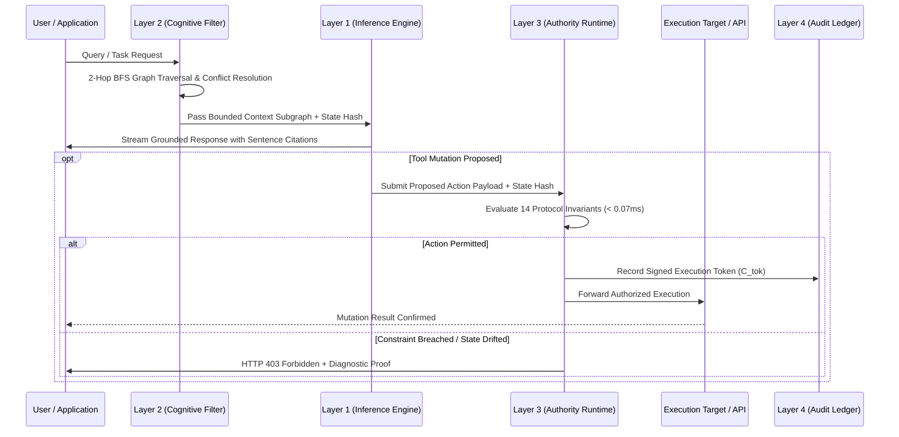

# RFC 0001: Verifiable Reality & Execution Authority Protocol for Large Language Models

**Network Working Group**  
**Request for Comments:** 0001  
**Category:** Protocol Standards  
**Author:** Exogram Protocol Team ([exogram.ai](https://exogram.ai))  
**Date:** September 2026

---

## 1. Abstract

This document defines the **Exogram Execution Authority & Grounded Reality Protocol**, an open architectural networking standard designed to anchor Large Language Models (LLMs) and autonomous agents in persistent, verifiable reality. 

While frontier language models possess exceptional reasoning capabilities within an ephemeral context window, their direct interaction with enterprise state and external mutation endpoints exposes systems to non-deterministic failure modes: hallucinated memory continuity, context poisoning, Time-Of-Check to Time-Of-Use (TOCTOU) state desynchronization, and unvalidated tool mutations.

The Exogram Protocol establishes a mathematically bounded substrate situated beneath the model layer. It guarantees:
1. **Bounded, Unpoisoned Context Assembly** via 2-hop topological BFS traversal across an immutable, encrypted entity-relationship graph.
2. **Epistemic Sentence Grounding** linking generated statements to cryptographic provenance records.
3. **Sub-0.07ms Deterministic Action Authorization** preventing unauthorized tool executions or state corruption before physical execution occurs.
4. **Cryptographic State Hashing** establishing a continuous, tamper-evident audit trail for every model response and action.

---

## 2. Conventions and Terminology

The key words "MUST", "MUST NOT", "REQUIRED", "SHALL", "SHALL NOT", "SHOULD", "SHOULD NOT", "RECOMMENDED", "MAY", and "OPTIONAL" in this document are to be interpreted as described in [RFC 2119](https://tools.ietf.org/html/rfc2119).

- **Execution Token ($C_{tok}$):** A cryptographic JWT (JSON Web Token) binding a specific tool mutation payload to a specific validated state hash.
- **Intent Dependencies ($\Gamma$):** The complete set of required subgraph constraints an action payload must satisfy to be deemed admissible.
- **Cognitive Filter:** The deterministic 2-hop graph extraction mechanism that isolates user namespace context and eliminates "Lost in the Middle" degradation.
- **State Drift:** The condition where persistent environment state changes between initial context retrieval ($T_0$) and action execution ($T_1$).
- **Authority Runtime:** The deterministic execution engine enforcing protocol invariants, rate limits, and policy gates at the network boundary.

---

## 3. Reference Architecture: The 4 Layers of LLM Reality & Autonomy

The modern AI stack requires an authoritative substrate beneath the model to achieve reliable, continuous operation. The Exogram Protocol formalizes this 4-layer architecture:

```
┌─────────────────────────────────────────────────────────────┐
│ Layer 1: The Inference Engine (LLM Reasoning & Proposal)    │
│ Probabilistic synthesis: Claude, GPT, Gemini, Llama         │
└──────────────────────────────┬──────────────────────────────┘
                               ▼
┌─────────────────────────────────────────────────────────────┐
│ Layer 2: The Cognitive Filter (Temporal Entity Graph)       │
│ 2-hop topological BFS, epistemic citation, conflict logging │
└──────────────────────────────┬──────────────────────────────┘
                               ▼
┌─────────────────────────────────────────────────────────────┐
│ Layer 3: The Authority Runtime (Governed Autonomy Gate)     │
│ Sub-0.07ms deterministic invariant check (ALLOW / DENY)     │
└──────────────────────────────┬──────────────────────────────┘
                               ▼
┌─────────────────────────────────────────────────────────────┐
│ Layer 4: The Proof (Cryptographic State & Audit Chain)      │
│ Chained SHA-256 state hashes, immutable event ledger        │
└─────────────────────────────────────────────────────────────┘
```

### Layer 1: The Inference Engine (Stochastic Generation)
- **Role:** Natural language understanding, contextual reasoning, code generation, and hypothesis formulation $\mathcal{L}(x)$.
- **Components:** Frontier reasoning models (Anthropic Claude, OpenAI GPT, Google Gemini, Meta Llama).
- **The Operational Challenge:** Operates probabilistically via temperature-based token sampling. It MUST NOT be solely relied upon for Boolean security validation or unverified historical memory recall.
- **Protocol Integration:** The model receives pre-grounded, topologically bounded context and generates proposed responses or structured tool call intents.

### Layer 2: The Cognitive Filter (Temporal Memory Ledger & Entity Graph)
- **Role:** Contextual grounding utilizing an authoritative, encrypted SQLite WAL ledger and 2-hop BFS entity graph.
- **The Operational Challenge:** Traditional vector search (cosine similarity on text chunks) retrieves semantically similar but factually irrelevant or out-of-date records, leading to prompt bloat, high latency, and context poisoning.
- **The Exogram Remedy:** Implements a deterministic "Cognitive Filter" architecture. By querying an entity-relationship graph via 2-hop BFS, Exogram extracts strictly relevant subgraphs, detects contradictory statements, and binds evidence directly to generated sentences.

### Layer 3: The Authority Runtime (Governed Autonomy Gate)
- **Role:** Deterministic action authorization and loop suppression $\mathbf{Evaluate}(P) \to \{ \text{ALLOW}, \text{DENY} \}$.
- **The Operational Challenge:** Multi-agent orchestrators execute instructions dictated by probabilistic LLMs without binary invariant verification, risking recursive infinite loops and unauthorized destructive mutations.
- **The Exogram Remedy:** Acts as an inline Authority Runtime. Evaluates 14 protocol invariants in under 0.07ms using server-side logic gates (zero LLM inference in the critical security path), issuing hard `HTTP 409 Conflict` or `HTTP 403 Forbidden` interventions when constraints are breached.

### Layer 4: The Proof (Cryptographic State & Audit Chain)
- **Role:** Tamper-evident, cryptographically chained verification ledger.
- **The Exogram Remedy:** Every state transition, context snapshot, and authorized execution generates a SHA-256 state hash. Hashes are linked sequentially, providing users, developers, and regulators with undeniable mathematical proof of why an answer was given and what evidence supported each mutation.

---

## 4. Threat Model and Failure Modes of Ungrounded LLMs

Directly binding probabilistic LLM tool calls to physical execution targets introduces three primary failure vectors:

### 4.1 Syntactic Correctness vs. Semantic Reality
Schema validators (Zod, Pydantic) verify data structure, not operational reality. If an LLM generates a syntactically perfect deletion payload (`{"target": "production_database", "force": true}`), schema validation passes. Without semantic intent verification against active policy invariants, catastrophic data loss occurs.

### 4.2 Context Poisoning & Semantic Drift in Traditional Memory
Traditional vector retrieval uses Cosine Similarity:
$$
\text{similarity}(A, B) = \frac{\mathbf{A} \cdot \mathbf{B}}{\|\mathbf{A}\| \|\mathbf{B}\|} = \cos(\theta)
$$
Because vector summation does not distinguish between authoritative facts and unverified user assertions, malicious prompt injections or outdated statements retain high cosine similarity. The Exogram Protocol prevents this by scoping context strictly to verified, namespace-isolated entity subgraphs with explicit provenance.

### 4.3 Time-Of-Check to Time-Of-Use (TOCTOU) Desynchronization
1. LLM retrieves user balance ($100) at $T_0$.
2. Model spends 15 seconds generating reasoning logic for a $100 transfer.
3. Concurrently, an external transaction deducts $50 at $T_1$.
4. At $T_2$, the model executes the $100 mutation against a drifted environment state.
5. The Exogram Protocol eliminates this by binding the execution token to the exact SHA-256 context state hash $\mathcal{H}(S_{context})$. If state changes prior to execution, the token is invalidated immediately.

---

## 5. Protocol Execution Intercept Sequence

The protocol enforces a clean boundary between model reasoning and physical execution:


```mermaid
sequenceDiagram
    participant User as User / Application
    participant Filter as Layer 2 (Cognitive Filter)
    participant LLM as Layer 1 (Inference Engine)
    participant Gate as Layer 3 (Authority Runtime)
    participant Target as Execution Target / API
    participant Ledger as Layer 4 (Audit Ledger)
    
    User->>Filter: Query / Task Request
    Filter->>Filter: 2-Hop BFS Graph Traversal & Conflict Resolution
    Filter->>LLM: Pass Bounded Context Subgraph + State Hash
    LLM->>User: Stream Grounded Response with Sentence Citations
    opt Tool Mutation Proposed
        LLM->>Gate: Submit Proposed Action Payload + State Hash
        Gate->>Gate: Evaluate 14 Protocol Invariants (< 0.07ms)
        alt Action Permitted
            Gate->>Ledger: Record Signed Execution Token (C_tok)
            Gate->>Target: Forward Authorized Execution
            Target-->>User: Mutation Result Confirmed
        else Constraint Breached / State Drifted
            Gate->>User: HTTP 403 Forbidden + Diagnostic Proof
        end
    end
```

---

## 6. Mathematical Foundations: Grounding and Admissibility

### 6.1 State Determinism and Conflict Resolution
Let $\Sigma_{memory}$ represent the universe of stored facts. The Cognitive Filter extracts a bounded, conflict-free subgraph $C_{bounded}$:

$$
S_{retrieved} = \{ f_1, f_2, \dots, f_n \}
$$

For any pair of conflicting facts $f_i, f_j$ where $\text{Conflict}(f_i, f_j) = \mathbf{True}$, the protocol applies an explicit recency, provenance, and authority weighting function $W(f)$:

$$
\forall (f_i, f_j) \in S_{retrieved}, \quad f_{survivor} = \arg\max_{f \in \{f_i, f_j\}} W(f)
$$

### 6.2 The Theorem of Governed Admissibility
Let $\mathcal{T}$ denote the set of proposed tool mutation payloads. Execution is authorized if and only if the current state hash matches the evaluated state hash and all intent constraints $\Gamma(P)$ are satisfied within $C_{bounded}$:

$$
\forall P \in \mathcal{T}, \quad \mathbf{Execute}(P) \iff \left( \mathcal{H}(S_{target}) = \mathcal{H}(S_{context}) \right) \land \left( \Gamma(P) \subseteq C_{bounded} \right)
$$

If $\Gamma(P) \not\subseteq C_{bounded}$, the Authority Runtime drops the mutation and issues an `HTTP 403 Forbidden` with structured diagnostic feedback.

---

## 7. Cryptographic Execution Gating

### 7.1 State Hash Binding
Upon policy approval, the Authority Runtime generates an ephemeral cryptographic execution token ($C_{tok}$):

```json
{
  "alg": "HS256",
  "typ": "JWT"
}
.
{
  "iss": "exogram.ai",
  "sub": "user_or_agent_identity",
  "target_tool": "stripe_refund_api",
  "payload_hash": "a4d3f6b9c2a89f1d...",
  "state_hash": "b8f1e40a2c9d8e7b...",
  "exp": 1713028302
}
```

### 7.2 Deterministic Recovery Mechanics
If state changes during model generation ($\Delta t_{state} \neq 0$) or proposed parameters violate active user constraints, execution is blocked without side effects, eliminating TOCTOU race conditions.

---

## 8. Recursive Loop & Token Exhaustion Suppression

To protect against runaway agentic loops and API cost spikes, the Authority Runtime tracks execution frequencies per session ledger $L[A_{id}]$:

$$
\forall P \in \mathcal{T}, \quad \text{If } \text{Count}(P_{hash} \mid L[A_{id}]) \ge \text{Threshold} \implies \mathbf{Emit}(\text{HTTP } 429)
$$

---

## 9. The Agentic Kill Switch Architecture

Administrators and users retain absolute control over AI operations through a deterministic kill switch:

$$
\text{If } GlobalState = \text{LOCKED} \implies \forall P \in \mathcal{T}, \quad \mathbf{Execute}(P) = \mathbf{False}
$$

---

## 10. Conclusion

The future of Large Language Models depends on bridging probabilistic intelligence with deterministic truth. By placing the Exogram Authority Runtime beneath frontier models, AI gains persistent memory that reflects reality, provides transparent evidence for every answer, and executes actions safely under governed human control.

**End of RFC 0001**
