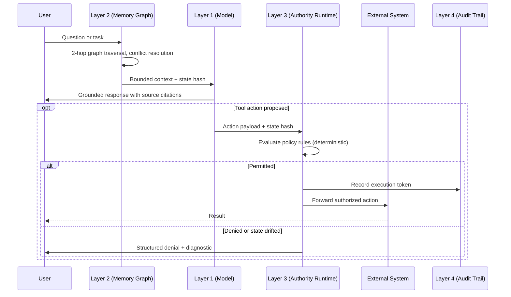

# RFC 0001: Persistent Memory, Epistemic Grounding & Execution Authority for Large Language Models

**Network Working Group**  
**Request for Comments:** 0001  
**Category:** Protocol Standards  
**Author:** Exogram Protocol Team ([exogram.ai](https://exogram.ai))  
**Date:** September 2026

---

## 1. Abstract

This specification defines the Exogram Protocol: an open standard for attaching persistent memory, evidence-based grounding, and deterministic execution safety to Large Language Models.

The protocol addresses three problems that exist in every major LLM deployment today:

1. **Memory loss.** Models don't accumulate knowledge about users, projects, or decisions across sessions. Every conversation starts blank.
2. **Unverifiable answers.** Models present all claims with equal confidence. Users cannot inspect which evidence, if any, supports a given statement.
3. **Unsafe execution.** When models are granted tool-use capabilities, nothing except the model's own judgment prevents destructive actions against production systems.

The Exogram Protocol introduces a four-layer substrate beneath the model that provides durable memory via an encrypted entity graph, per-sentence evidence attribution, and deterministic action authorization that operates without invoking another LLM.

---

## 2. Conventions and Terminology

The key words "MUST", "MUST NOT", "REQUIRED", "SHALL", "SHALL NOT", "SHOULD", "SHOULD NOT", "RECOMMENDED", "MAY", and "OPTIONAL" in this document are to be interpreted as described in [RFC 2119](https://tools.ietf.org/html/rfc2119).

- **Ledger Entry:** A timestamped, encrypted fact stored in the user's personal vault. Contains a canonical claim, topic, source provenance, confidence score, and hash.
- **Entity Graph:** A topological knowledge graph connecting people, organizations, projects, documents, events, and concepts extracted from ledger entries.
- **Epistemic Grounding:** The process of linking individual sentences in a model response to the specific ledger entries and sources that justify them.
- **Authority Runtime:** The deterministic execution gate that evaluates proposed tool actions against policy rules using code (not LLM inference).
- **Execution Token ($C_{tok}$):** A cryptographic JWT binding a validated action payload to a specific state hash. Expires after a defined TTL.
- **State Hash ($\mathcal{H}$):** SHA-256 hash of the current context state at evaluation time, used to detect drift before execution.

---

## 3. Architecture

### 3.1 Layer 1: Model Inference

The language model generates reasoning, text, and proposed tool calls. The model operates on pre-grounded context assembled by Layer 2 rather than raw, unbounded retrieval. This reduces hallucination surface area and eliminates the "Lost in the Middle" degradation that occurs when models are given long, loosely relevant context.

The protocol is model-agnostic. The reference implementation routes across Gemini, Claude, and local models (Ollama/Phi-4) with provider-level failover.

### 3.2 Layer 2: Memory & Entity Graph

This is the layer that makes Exogram different from a chatbot with vector search bolted on.

**The problem with traditional RAG:** Vector similarity retrieval (cosine similarity over embeddings) finds text that *sounds* related. It doesn't distinguish between a verified fact from last week and an unverified assertion from six months ago. It doesn't know that two records contradict each other. It doesn't understand that "the project" in document A refers to the same project mentioned in email B.

$$
\text{similarity}(A, B) = \frac{\mathbf{A} \cdot \mathbf{B}}{\|\mathbf{A}\| \|\mathbf{B}\|} = \cos(\theta)
$$

Cosine similarity measures semantic distance. It says nothing about truth, recency, or provenance.

**The Exogram approach:** Instead of dumping text chunks into the prompt, the protocol maintains:

1. **An encrypted fact ledger** (SQLite WAL with PBKDF2/Fernet encryption at rest) where each entry is a timestamped, attributed claim with a confidence score that decays over time unless reinforced.
2. **A topological entity graph** connecting people, projects, events, organizations, and concepts. Relationships are typed and weighted.
3. **Bounded graph traversal** via 2-hop BFS from seed entities mentioned in the user's query. This produces a small, relevant subgraph instead of an unbounded similarity search across the entire corpus.

When a user asks "Can we deploy the authentication update today?", the system doesn't search for documents containing the word "deploy." It identifies the authentication project entity, traverses its relationships to find recent integration test results, deployment policy versions, and team availability, and assembles that specific context for the model.

**Epistemic sentence grounding:** After the model generates a response, individual claims are linked back to the ledger entries and sources that support them. The user sees inline citations they can inspect: which fact, when it was recorded, what its confidence score is, and where it came from.

### 3.3 Layer 3: Authority Runtime (Governed Autonomy)

When the model proposes an action (API call, database mutation, file write, code execution), the request passes through a deterministic policy gate before reaching the target system.

The gate evaluates the request against compile-time policy rules:

$$
\forall P \in \mathcal{T}, \quad \mathbf{Execute}(P) \iff \left( \mathcal{H}(S_{target}) = \mathcal{H}(S_{context}) \right) \land \left( \Gamma(P) \subseteq C_{bounded} \right)
$$

Where $\Gamma(P)$ is the set of constraints the action must satisfy and $C_{bounded}$ is the validated context subgraph.

Two properties matter here:

1. **No LLM in the safety path.** The gate is deterministic code. It evaluates boolean conditions, not probabilities. A schema validator checks data structure. The Authority Runtime checks intent against policy.
2. **State hash binding.** The execution token is bound to the SHA-256 hash of the context state at evaluation time. If the underlying state changes between evaluation and execution (a TOCTOU race condition), the token is invalidated and the action is blocked.

If the action is denied, the user receives a structured diagnostic explaining which policy was violated and why.

### 3.4 Layer 4: Audit Trail

Every context assembly, model response, and execution decision generates a SHA-256 hash chained to the previous state:

```json
{
  "state_hash": "b8f1e40a2c9d8e7b...",
  "parent_hash": "a1b2c3d4e5f67890...",
  "timestamp": "2026-09-14T21:05:34Z",
  "event_type": "response_generated",
  "context_snapshot_id": "ctx-8f72c91a",
  "sources_cited": ["ledger-001", "ledger-047", "web-003"]
}
```

This chain provides tamper-evident proof of what the model knew at the time it generated a response. Users can inspect the evidence trail. Compliance teams can audit decisions. Developers can debug unexpected behavior by replaying the exact context state.

---

## 4. Protocol Execution Sequence


```mermaid
sequenceDiagram
    participant User as User
    participant Memory as Layer 2 (Memory Graph)
    participant LLM as Layer 1 (Model)
    participant Gate as Layer 3 (Authority Runtime)
    participant Target as External System
    participant Ledger as Layer 4 (Audit Trail)

    User->>Memory: Question or task
    Memory->>Memory: 2-hop graph traversal, conflict resolution
    Memory->>LLM: Bounded context + state hash
    LLM->>User: Grounded response with source citations
    opt Tool action proposed
        LLM->>Gate: Action payload + state hash
        Gate->>Gate: Evaluate policy rules (deterministic)
        alt Permitted
            Gate->>Ledger: Record execution token
            Gate->>Target: Forward authorized action
            Target-->>User: Result
        else Denied or state drifted
            Gate->>User: Structured denial + diagnostic
        end
    end
```

---

## 5. What This Looks Like in Practice

**Contextual defaults (zero prompt tax):**
A user asks: "Where should we go for vacation in October?"

A traditional LLM asks five clarifying questions before producing anything useful. The Exogram Protocol already has the user's entity graph: their home location, family members, relevant October milestones, travel preferences, and budget constraints. The model receives this context pre-assembled and produces a personalized recommendation without the user having to write a briefing document.

**Evidence-grounded responses:**
When the model states "The latest integration test failed after the middleware change," the user can click the inline citation and see: Ledger Entry #4f12, recorded September 14th, confidence 98%, source: CI pipeline webhook. The claim isn't just plausible. It's traceable.

**Safe execution:**
An autonomous agent proposes `DROP TABLE production_users`. The Authority Runtime evaluates this against policy rule SEC_RULE_04 (no destructive mutations on production clusters), denies execution, and returns a structured diagnostic. The denial happens in under 0.1ms, without invoking another model.

---

## 6. Failure Modes Without This Protocol

### 6.1 Hallucinated Continuity
Without persistent memory, models confuse project versions, invent past agreements, and present fabricated context with the same confidence as verified facts. The user has no way to distinguish real memory from generated text.

### 6.2 Context Poisoning
Traditional vector retrieval doesn't distinguish between authoritative records and stale or adversarial content. Malicious prompt injections and outdated assertions retain high cosine similarity. The protocol prevents this by scoping retrieval to verified, namespace-isolated entity subgraphs with explicit provenance.

### 6.3 TOCTOU Races
Between the time the model evaluates a situation and the time it acts on that evaluation, the world can change. The protocol eliminates this by binding execution tokens to state hashes. If the hash doesn't match at execution time, the action is blocked.

---

## 7. Recursive Loop Suppression

The Authority Runtime tracks execution frequency per session:

$$
\forall P \in \mathcal{T}, \quad \text{If } \text{Count}(P_{hash} \mid L[A_{id}]) \ge \text{Threshold} \implies \mathbf{Emit}(\text{HTTP } 429)
$$

This prevents runaway agentic loops from exhausting API budgets or generating cascading mutations.

---

## 8. Kill Switch

Users retain absolute control:

$$
\text{If } GlobalState = \text{LOCKED} \implies \forall P \in \mathcal{T}, \quad \mathbf{Execute}(P) = \mathbf{False}
$$

When activated, all pending and future actions are blocked globally. No exceptions, no overrides.

---

## 9. Benchmarks

The reference implementation achieves:

- **137 RPS** sustained throughput per node
- **< 0.07ms** policy evaluation latency
- **14** protocol invariants enforced at the execution boundary
- **Zero** LLM inference calls in the safety-critical path
- **Per-request audit telemetry** recorded to immutable ledger

---

## 10. Conclusion

The reasoning capability of language models improves with every generation. Their ability to remember what happened yesterday, prove why they said what they said, and avoid doing something destructive when given agency does not.

The Exogram Protocol provides the substrate that makes those capabilities possible: durable memory that connects facts across time, evidence attribution that makes answers verifiable, and deterministic safety gates that make autonomous action trustworthy.

The protocol is open. The specification is public. The reference implementation is [exogram.ai](https://exogram.ai).

**End of RFC 0001**
