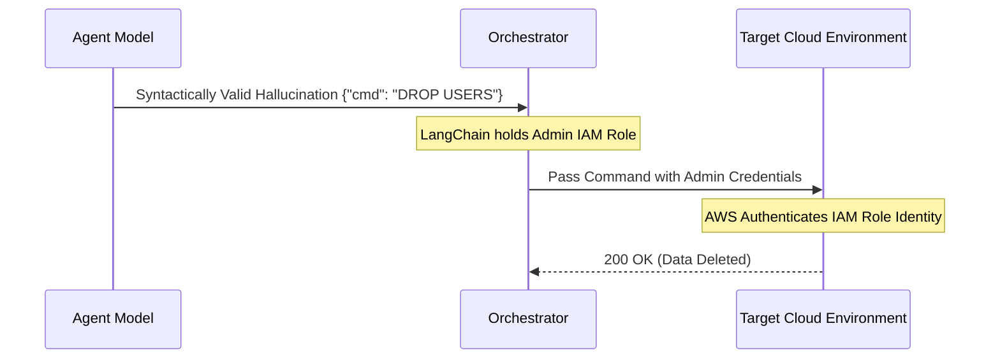
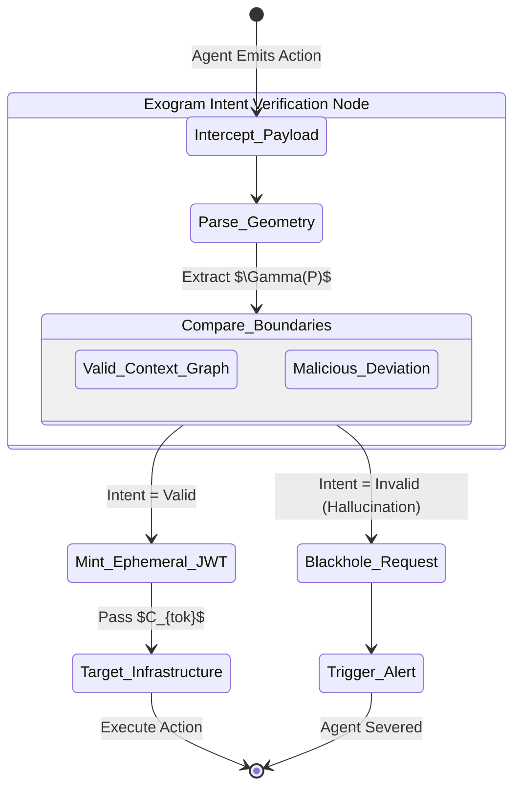

# RFC 0002: Intent-Based Permissioning (IBP)

**Network Working Group**  
**Request for Comments:** 0002  
**Category:** Security Architecture Standards  
**Author:** Exogram Protocol Team ([exogram.ai](https://exogram.ai))  
**Date:** April 2026

---

## 1. Abstract

Identity and Access Management (IAM) and Role-Based Access Control (RBAC) are foundational to strict human-centric enterprise security. However, when applied to autonomous AI Agents, these legacy standards result in systemic failure. This document defines **Intent-Based Permissioning (IBP)**, the security standard utilized by the Exogram Protocol to restrict AI operations dynamically based on the algorithmic intent of the request rather than the static identity of the requester.

---

## 2. The Failure of the RBAC Paradigm

In traditional infrastructure (AWS IAM, Okta), a user or service account is given persistent, standing privileges (e.g., `s3:DeleteObject`). 

When AI Agents (LangChain orchestration nodes) inherit these credentials, they hold the power of those credentials indefinitely. Because large language models are probabilistic, they can and will hallucinate. If an agent with a `database:write` role hallucinates a command to `DROP TABLE users;`, the downstream infrastructure authenticates the valid IAM role and blindly executes the destructive state.

### Role-Based Access Control Vulnerability Vector

**Conclusion:** Identity authentication is useless when the identical entity can organically switch from benign reasoning to unprompted destruction.

---

## 3. Intent-Based Permissioning (IBP) Architecture

Intent-Based Permissioning flips the authentication framework. Instead of asking **"Who is making this request?"**, the Exogram EA Layer asks, **"What is the physical mathematical effect of this request on the target state?"**

Permissions are NOT statically assigned to the Agent. They are ephemerally generated for the specific *payload*.

### 3.1 The IBP Evaluation Matrix

When a payload $P$ is intercepted, the EA node constructs an Intent Graph $\Gamma_{intent}$. The protocol requires measuring the proposed operation against the bounded constraint sub-graph $C_{bounded}$.

$$
Auth(P) \iff \forall \text{node } n \in \Gamma_{intent}(P), \exists \text{ path } \Phi \text{ in } C_{bounded} \ \text{validating } n
$$

If, and only if, the semantic result of the payload aligns exclusively with the bounded rules of the context, the EA Node mints a millisecond-duration cryptographic token authorizing ONLY that specific transaction.

---

## 4. The Autonomy Verification Flow

Below is the state-machine representation of how Intent is mathematically isolated from Identity.

---

## 5. Implementation Requirements

To strictly adhere to the IBP standard, infrastructure endpoints MUST:
1. Strip all standing IAM write-roles from AI Orchestrator service accounts.
2. Demand an Exogram `$C_{tok}` JWT for all mutation events originating from algorithmic environments.

## 6. Conclusion 
You cannot give a probabilistic agent a persistent key to a deterministic lock. By evaluating the intention of the action instead of the identity of the actor, Intent-Based Permissioning establishes a mathematically sound execution barrier.

**End of RFC 0002**
