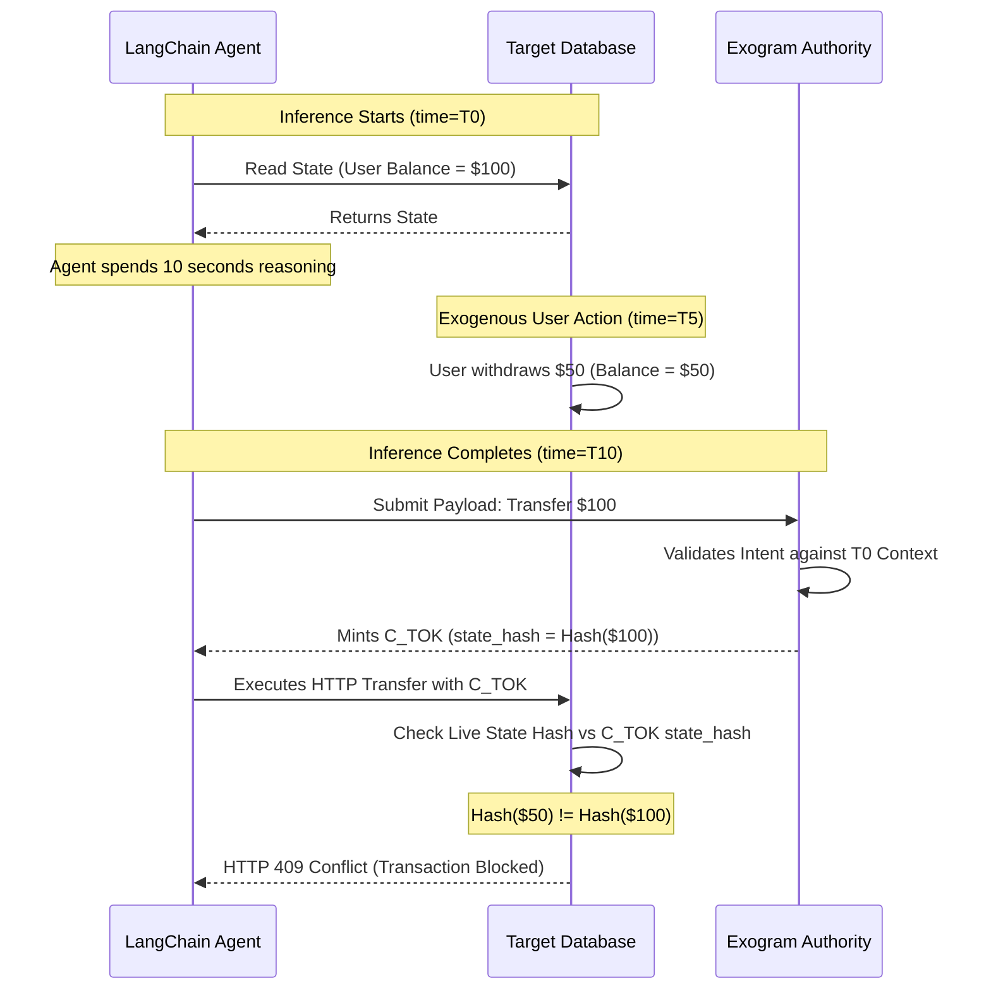

# RFC 0003: Cryptographic Execution Tokens ($C_{TOK}$)

**Network Working Group**  
**Request for Comments:** 0003  
**Category:** Cryptography & Identity Standards  
**Author:** Exogram Protocol Team ([exogram.ai](https://exogram.ai))  
**Date:** April 2026

---

## 1. Abstract

Upon successful verification of payload admissibility (per RFC 0001), the Exogram Execution Authority must transmit authorization across an untrusted network. This document establishes the strict byte-structure, hashing algorithms, and Time-To-Live (TTL) boundaries for the **Cryptographic Execution Token** ($C_{tok}$). 

This token architecture specifically mitigates TOCTOU (Time-Of-Check to Time-Of-Use) state desynchronization events inherent to variable-duration stochastic agent inference.

---

## 2. Token Geometry and Algorithms

The Execution Token MUST follow the JSON Web Token (JWT) IETF RFC 7519 standard structure, utilizing **HS256** (HMAC using SHA-256) signature verification.

### 2.1 The Header (`JOSE`)
The header rigidly defines the symmetric hashing mechanism.
```json
{
  "alg": "HS256",
  "typ": "JWT"
}
```

### 2.2 The Payload Geometry
The payload MUST uniquely bind the agent identity, the target operation, and both the state and payload mathematical representations.

```json
{
  "iss": "exogram.network",
  "sub": "agent_alpha_node_1",
  "target_tool": "stripe_refund_api",
  "payload_hash": "a4d3f6b9c2a89f1d",
  "state_hash": "b8f1e40a2c9d8e7b",
  "iat": 1713028300,
  "exp": 1713028302
}
```

#### Field Definitions
- `payload_hash`: The SHA-256 hash of the exact JSON payload the agent is attempting to execute. If a single byte changes in transit, the signature is invalidated.
- `state_hash`: The SHA-256 hash of the specific vector/graph context variables evaluated during the Intent Evaluation. Required for TOCTOU mitigation.
- `exp`: (Expiration Time). Defined below in the TTL Constraints section.

---

## 3. TOCTOU Handshake Flow (Time-Of-Check to Time-Of-Use)

The most severe unmanaged vulnerability in multi-agent orchestration is state desynchronization. Because inference can take $5$ to $60$ seconds, the database state may change between the context retrieval and the action execution.

The Exogram protocol solves this mathematically using the `state_hash` embedded in the $C_{tok}$.



By enforcing that the downstream target node mathematically calculates its *live* state hash in $< 1\text{ms}$ and verifies it against the token's expected state hash, TOCTOU desynchronizations are entirely eradicated.

---

## 4. Time-To-Live (TTL) Expiration Constraints

Because an Execution Token is only valid for a specific subset of state and memory dynamics, granting long-term validity exposes the network to replay attacks.

The Exogram EA Layer MUST enforce ultra-narrow TTL lifetimes based on the physical transport latency required to reach the target API.

Let $\delta_{network}$ represent average internal cluster ping times (e.g., $5\text{ms}$).
Let $\tau_{buffer}$ represent standard computational overhead (e.g., $1000\text{ms}$).

$$
\text{TTL}_{token} \leq \delta_{network} \times 2 + \tau_{buffer}
$$

Any $C_{tok}$ exceeding a $2$-second lifespan is formally deemed non-compliant and SHOULD trigger an incident report to the Agent Orchestrator. 

## 5. Conclusion
A mathematically verified intent is useless if the executing token can be intercepted, delayed, or run against an altered backend graph. The Exogram $C_{tok}$ standard finalizes the absolute security edge by cementing state at the millisecond of authorization.

**End of RFC 0003**
