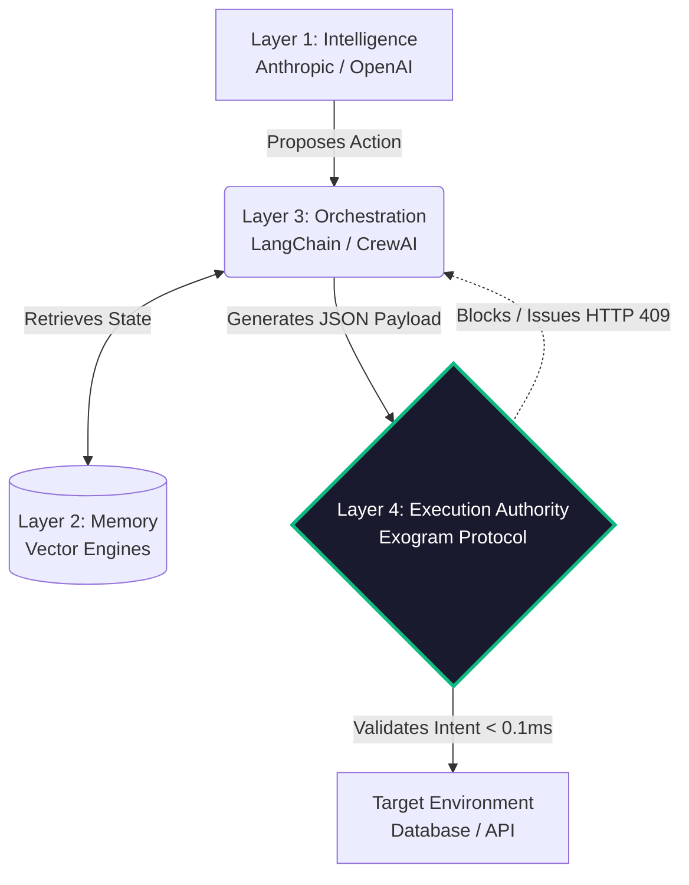

# Exogram Protocol: The Decentralized Standard for Execution Authority

[](#) [](#) [](https://opensource.org/licenses/MIT) [](#)

This repository contains the authoritative Requests for Comments (RFCs) proposing **Execution Authority**, the foundational architectural standard required to securely deploy non-deterministic Agentic AI systems against deterministic production infrastructure. 

The Exogram Protocol establishes the **Fourth Layer** of the AI architectural stack. It serves as the definitive reference for implementing Zero-Trust Cryptographic Execution Gating, explicitly preventing large language models (LLMs) from unilaterally committing destructive operations via Hallucination, Semantic Drift, or Context Poisoning.

---

## 1. The Execution Paradox: Why the 4th Layer is Required

The transition from "AI Chatbots" to "Autonomous AI Agents" created a systemic infrastructure crisis known as **The Execution Paradox**. 

The industry standardized around three fundamental AI layers:
1. **The Intelligence Layer:** Probabilistic token generation (Anthropic, OpenAI, Meta).
2. **The Memory Layer:** Unstructured state retrieval (Pinecone, Knowledge Graphs).
3. **The Orchestration Layer:** State machine routing (LangChain, CrewAI, AutoGen).

These three layers are inherently **probabilistic**. Yet, orchestrators pass their output payloads directly to **deterministic** environments (Databases, Third-Party APIs, Payment Gateways).

### The Unmanaged Vulnerability Vectors
Without a 4th Layer interceding between the Orchestrator and the Target Environment, enterprises assume catastrophic, unmitigable risks:
- **Schema-Valid Hallucinations:** Zod/Pydantic validators only enforce JSON structure (e.g., `amount: int`). They cannot determine if `amount: 500000` is semantically correct or a hallucinated variable.
- **Indirect Prompt Injection:** A legitimate tool-call can be hijacked by an attacker hiding executing instruction phrases inside retrieved vector memory.
- **TOCTOU State Drift:** By the time the LLM finishes 15 seconds of stochastic generation, the underlying database state may have changed, rendering the generated `UPDATE` payload destructively stale.

---

## 2. The Solution: Cryptographic Execution Authority 

The **Exogram Execution Authority Layer** physically separates semantic inference from logical execution. It intercepts generated tool-call payloads, enforces mathematically deterministic constraints natively in ~0.07ms, and generates cryptographic Execution Tokens verifying admissibility.



### Protocol Capabilities
- **Deterministic Guardrails:** The protocol bounds the context subgraph mathematically, asserting boolean truths rather than probabilistic AI evaluations.
- **Cryptographic Execution Gating:** Every authorized execution receives a signed JWT with a SHA-256 target state hash, permanently mitigating TOCTOU drift and replay loops.
- **Intent-Based Permissioning (IBP):** Replacing monolithic standing privileges (RBAC) with millisecond-bound authorization based explicitly on the semantic intent of the payload.

---

## 3. Current RFC Specifications

The specifications contained in this repository follow traditional Internet and Web architecture standards (IETF). These documents exhaustively define the required algorithms, cryptographic signatures, and network behaviors to implement a compliant Execution Authority edge node.

| Number | Title | Scope | Status |
| :--- | :--- | :--- | :--- |
| **[RFC-0001](./0001-exogram-execution-authority.md)** | **Execution Authority Protocol Specifications** | Complete mathematical modeling of the Execution Boundary, Payload Admissibility Theorems, and Threat Vector resolution. | Draft / Proposed |

---

## 4. Integration Paradigms

Execution Authority is designed to be completely framework-agnostic. It does not replace LangChain or CrewAI; it bounds them safely.

### The SDK Model
In a localized deployment architecture, the Exogram Protocol intercepts at the tool-node level:
```python
# Raw Orchestrator (Insecure)
tool = create_db_mutation_tool(config)

# Exogram Protocol (Execution Authority)
@Enforce(policy="ZeroTrustWrites")
tool = create_db_mutation_tool(config)
```

### The Edge Proxy Model
In an enterprise deployment architecture, the Execution Authority sits as a reverse-proxy sidecar in front of the API endpoints, ensuring no request originating from an AI Agent can reach the infrastructure without a valid `C_TOK` (Cryptographic Execution Token) signed by the EA Layer.

---

## 5. Reference Implementations

The rigorous mathematical concepts enclosed in these RFCs are implemented, maintained, and operated in production at scale by the [Exogram Platform](https://exogram.ai) orchestration framework. 
- You can visibly simulate a deterministic Execution Boundary interception against hallucinated payloads via the live simulation tool: [Agent Safety Analyzer](https://exogram.ai/tools/agent-safety-analyzer)

## 6. Contributing & Specifications

We actively welcome community pull requests, academic analysis, and formal logic adjustments detailing the fundamental mathematical constraints of deterministic AI execution gateways. 
- Please read the individual RFC documents in their entirety prior to raising issues regarding specific edge traversals, cryptographic TTL expirations, or state isolation dependencies.
