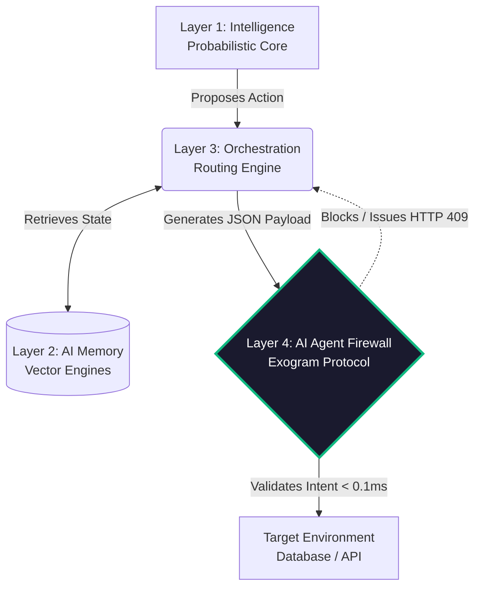

# Exogram Protocol: The AI Agent Firewall & API Standard

[](#) [](#) [](https://opensource.org/licenses/MIT) [](https://github.com/Richard-Ewing/exogram-protocol-rfc/stargazers)

**If you believe AI Agents need hard mathematical boundaries, star this repository to demand open execution standards.**

This repository contains the authoritative Requests for Comments (RFCs) proposing **Execution Authority**, the foundational architectural standard required to securely deploy non-deterministic AI Agents against deterministic production infrastructure. 

The Exogram Protocol establishes the **Fourth Layer** of the AI architectural stack. It serves as the definitive reference for implementing **AI Agent Guardrails**, **AI Agent Firewalls**, and Zero-Trust Cryptographic Execution Gating. It explicitly prevents AI models from unilaterally committing destructive operations via Probabilistic Variance, Semantic Drift, or Context Poisoning.

---

## 1. The Execution Paradox: Why the 4th Layer is Required

The transition from "AI Chatbots" to "Autonomous AI Agents" created a systemic infrastructure crisis known as **The Execution Paradox**. The industry standardized around three fundamental AI layers (Intelligence, Memory, Orchestration) which are inherently **probabilistic**. Yet, they are granted direct write-access to **deterministic** environments (Databases, Third-Party APIs, Payment Gateways).

### The Unmanaged Vulnerability Vectors (The "Gaps")
Without an **AI Agent Firewall** interceding between the Orchestrator and the Target Environment, enterprises assume catastrophic risks:
- **Schema-Valid Unauthorized Executions:** Zod/Pydantic validators only enforce JSON structure. They cannot determine if `amount: 500000` is semantically correct or a hallucinated variable.
- **AI Agent Memory Poisoning:** A legitimate tool-call can be hijacked by an attacker hiding executing instruction phrases inside retrieved vector memory.
- **TOCTOU State Drift:** By the time the LLM finishes stochastic generation, the underlying database state may have changed, rendering the generated payload destructively stale.

---

## 2. The Universal Exogram API Manifesto

The Exogram Protocol is not a competitor to the current AI stack—it is the unified safety mesh that links it all together. **Every AI company** must eventually bridge the Execution Gap. The Exogram API is designed to integrate seamlessly across all layers to prevent probabilistic variance, enforce trust, and stop context drift.

### Layer 1: Intelligence Models (Anthropic, OpenAI, Meta, xAI)
- **The Gap:** LLMs are probability engines. They will inevitably hallucinate syntactically perfect but semantically disastrous JSON payloads.
- **The Exogram API Integration:** Intelligence models submit proposed tool payloads to the Exogram API. Exogram mathematically verifies the intent boundary in $< 0.1$ms. If it's a probabilistic variance, Exogram blocks it and responds with `403 Forbidden`, correcting the model before reality is modified.

### Layer 2: AI Agent Memory (Pinecone, Databricks, Zep, Mem0)
- **The Gap:** Vector search blindly retrieves closest approximations. This creates **AI Agent Memory Poisoning** where malicious prompts inject instructions via document retrieval.
- **The Exogram API Integration:** Memory state is cryptographically hashed and bound to the Execution Token. If the memory retrieves corrupted injected data, the resulting semantic intent evaluates as mathematically disjointed from the allowed policy graph. Exogram drops the execution.

### Layer 3: Agent Orchestrators (LangChain, CrewAI, AutoGen, Letta)
- **The Gap:** LangChain runs probabilistic logic loops. If an agent hallucinates a recursive retry, the orchestrator triggers infinite loop death spirals, destroying local rate limits and databases.
- **The Exogram API Integration:** As the ultimate **AI Agent Firewall**, the Exogram Execution Ledger issues an `HTTP 429 Too Many Requests` or `409 Conflict` at the infrastructure network edge, severing the Orchestrator's execution loop mathematically. 

### Layer 4: Target Infrastructure (Stripe, PostgreSQL, AWS)
- **The Gap:** Infrastructure relies on standing, monolithic RBAC roles. If an AI agent has permission to "read invoice," but it hallucinates a "delete user" command with the same credentials, the database blindly complies.
- **The Exogram API Integration:** Exogram generates Millisecond **Intent-Based Permissioning (IBP)** JWT execution tokens. Infrastructure proxies only accept requests carrying Exogram's $C_{tok}$, ensuring least-privilege for autonomous actors.

---

## 3. The Solution: Cryptographic Execution Authority 

The **Exogram Governance Infrastructure** makes autonomous intelligence persistent and verifiable. It physically separates semantic inference from logical execution, intercepts generated tool-call payloads, enforces mathematically deterministic constraints natively in ~0.07ms, and generates cryptographic Execution Tokens verifying admissibility.



### SDK Integration Example (LangChain)

```python
from exogram import ExogramGuard
from langchain.agents import initialize_agent

# Instead of passing tools directly to an LLM, wrap them in the Protocol Guard
safe_tools = ExogramGuard.wrap_tools(
    tools=[database_write_tool],
    policy="STRICT_DETERMINISM",
    tenant_id="enterprise_12"
)

# The Orchestrator operates normally, but is now cryptographically bound
agent = initialize_agent(safe_tools, llm, agent="zero-shot-react-description")
```

---

## 4. The Infrastructure Documentation Hub

To fully grasp how Execution Authority functions at the physical networking layer, we have extracted our comprehensive research into a 7-part Infrastructure Hub. 

### The 4 Execution Layers
- [Layer 1: Intelligence](./docs/layer-1-intelligence.md) - Why relying on LLMs for exact execution guarantees is mathematically impossible.
- [Layer 2: AI Agent Memory](./docs/layer-2-memory.md) - The geometry of Pinecone/Milvus cosine-similarity and why RAG is vulnerable to context poisoning.
- [Layer 3: Orchestration](./docs/layer-3-orchestration.md) - How LangChain loops scale to infinity, and how Exogram mathematically severs recursive death states.
- [Layer 4: Execution Authority](./docs/layer-4-execution-authority.md) - The Exogram interception firewall.

### Synthesis & Integration
- [Synthesis: The Full Stack](./docs/synthesis-the-full-stack.md) - A fully mapped visualization of the 4 layers operating concurrently securely.
- [Enterprise AI Companies](./docs/enterprise-ai-companies.md) - B2B analysis for SaaS providers: Eliminating liability, hitting SOC2 compliance, and zeroing out recursive token costs.
- [Developer & Agent Tooling](./docs/developer-agent-tooling.md) - Native integrations via embedded SDKs, CLI safety scanners, and MCP (Model Context Protocol).

---

## 5. Current RFC Specifications Directory

This repository holds multiple interlinked formal specifications. Developers and security architects MUST review all standards to implement a compliant EA infrastructure node.

| Number | Title | Scope | Status |
| :--- | :--- | :--- | :--- |
| **[RFC-0001](./0001-exogram-execution-authority.md)** | **Execution Authority Protocol Specifications** | Complete mathematical modeling of AI Agent Guardrails, Payload Admissibility Theorems, and Threat Vector resolution. | Draft / Proposed |
| **[RFC-0002](./0002-intent-based-permissioning.md)** | **Intent-Based Permissioning (IBP)** | Defining the failure of IAM/RBAC models and the standard for dynamic, semantic permissioning grids. | Draft / Proposed |
| **[RFC-0003](./0003-cryptographic-execution-tokens.md)** | **Cryptographic Execution Tokens ($C_{TOK}$)** | Network layer byte-structures, SHA-256 state hashing algorithms, and strict millisecond TTL payload constraints. | Draft / Proposed |

---

## 6. Reference Implementations

The rigorous mathematical concepts enclosed in these RFCs are implemented, maintained, and operated in production at scale by the [Exogram Platform](https://exogram.ai). 
- See the AI Agent Firewall in action via the live simulation tool: [Agent Safety Analyzer](https://exogram.ai/tools/agent-safety-analyzer)

## 7. Contributing & Community

We actively welcome community pull requests, academic analysis, and formal logic adjustments detailing the fundamental mathematical constraints of deterministic AI execution gateways. 

**Join us in building the unified execution authority for the next generation of autonomous systems. Please star the repository if you support mathematical AI agent guardrails!**

---

## 8. Resources & Links

| Resource | URL |
| :--- | :--- |
| **Protocol Specification (EAAP)** | [exogram.ai/protocol](https://exogram.ai/protocol) |
| **Architecture Deep-Dive** | [exogram.ai/architecture](https://exogram.ai/architecture) |
| **How It Works** | [exogram.ai/how-it-works](https://exogram.ai/how-it-works) |
| **API Reference** | [exogram.ai/docs/api](https://exogram.ai/docs/api) |
| **Quick Start Guide** | [exogram.ai/quickstart](https://exogram.ai/quickstart) |
| **Proving Ground (Live Demo)** | [exogram.ai/proving-ground](https://exogram.ai/proving-ground) |
| **Compare: Exogram vs Alternatives** | [exogram.ai/compare](https://exogram.ai/compare) |
| **Use Cases** | [exogram.ai/use-cases](https://exogram.ai/use-cases) |
| **Learning Hub** | [exogram.ai/learn](https://exogram.ai/learn) |
| **Glossary** | [exogram.ai/glossary](https://exogram.ai/glossary) |
| **Blog** | [exogram.ai/blog](https://exogram.ai/blog) |
| **RFC-0001 (Web)** | [exogram.ai/rfc/0001](https://exogram.ai/rfc/0001) |
| **Integrations Directory** | [exogram.ai/integrations](https://exogram.ai/integrations) |
| **Security & Compliance** | [exogram.ai/security-and-compliance](https://exogram.ai/security-and-compliance) |
