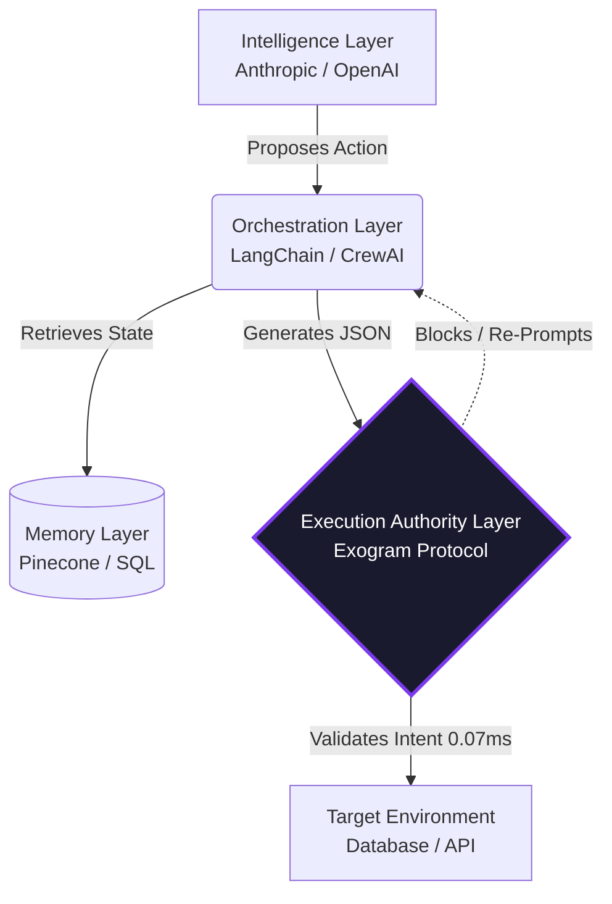

# Exogram Execution Authority Protocol

  

This repository contains the Requests for Comments (RFCs) proposing **Execution Authority**, a modernized architectural standard for zero-trust interactions between agentic orchestrators and production infrastructure.

## Architectural Context: The 4th Layer

The Generative AI industry has standardized around three distinct layers. This protocol introduces the critical, missing fourth layer required for deterministic, unsupervised deployments.

### The Unmanaged Vulnerability Vector
Currently, probabilistic entities (Large Language Models) are granted direct write-access to deterministic infrastructure (databases, APIs, payment gateways) via unprotected Orchestration frameworks. This gap creates massive attack surfaces for **schema hallucination**, **Time-of-Check to Time-of-Use (TOCTOU) state drift**, and **indirect context poisoning**.

The **Execution Authority Layer**, mathematically defined in these RFCs, intercepts generated tool-call payloads and enforces mathematically deterministic constraints natively in ~0.07ms before they physically interact with external environments.

## Current RFCs

The specifications are organized identically to traditional Internet and Web architecture standards.

| Number | Title | Status |
| :--- | :--- | :--- |
| **[RFC-0001](./0001-exogram-execution-authority.md)** | **Execution Authority Protocol Specifications** | Draft / Proposed |

## Reference Implementations

The concepts enclosed in these RFCs are implemented in production by the official [Exogram Platforms](https://exogram.ai) architecture. 
- You can visibly simulate an Execution Boundary interception here: [Agent Safety Analyzer](https://exogram.ai/tools/agent-safety-analyzer)

## Contributing & Specifications

We welcome community push requests, analysis, and formal logic adjustments detailing the fundamental mathematical specifications of deterministic AI execution gateways. Please read the individual RFCs prior to raising issues regarding edge traversals or state isolation dependencies.
