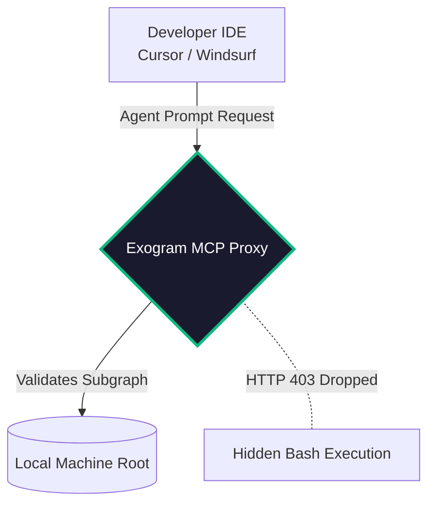

# Developer & Agent Tooling (CLI / MCP / API)

Exogram provides open standards for integrating the Execution Authority natively into your developer workflow. 

## The Core Interaction Modalities

### 1. Embedded API (The Native Integration)
The standard method of securing LangChain or AutoGen nodes. Wrap your deterministic tools in the Exogram SDK so that the intent is evaluated natively before passing the parameters to the physical function.

```python
from exogram.sdk import ExogramAuthority
from langchain.tools import tool

# Exogram decorates the tool to mathematically intercept generated payloads
@ExogramAuthority(intent_policy="STRICT_READ_ONLY")
@tool
def get_user_database_record(user_id: str):
    """Fetches user data from PostgreSQL"""
    pass 
```

### 2. The Exogram CLI (Deployment Validations)
Exogram provides a robust CLI to map the Execution boundaries of your specific repository during the CI/CD deployment phase. 

```bash
# Analyze your application logic matrix for possible Token bypasses
$ exogram scan ./src

> Initiating Graph Matrix Build...
> [WARN] Context Poisoning Vulnerability spotted in `pinecone_search.ts`
> [FIX] Wrap response in Exogram.HashContext()
```

### 3. Model Context Protocol (MCP) Servers
The Exogram Execution Authority operates natively as an **MCP Server**, allowing tools like Cursor or Windsurf to inject agentic safety constraints directly into the IDE context windows. 

Instead of configuring your own API interceptors, you configure an MCP Client to point to the `exogram-mcp-server`. 

#### MCP Isolation Architecture


The IDE natively respects the execution boundaries, mathematically guaranteeing no local tools are executed arbitrarily by your coding assistant without cryptographic authorization passing the Admissibility formula:

$$
Execute(MCP) \iff \left( \Gamma_H \subseteq \mathcal{V}_{auth} \right)
$$

### Configuration
```json
{
  "mcpServers": {
    "exogram-authority": {
      "command": "npx",
      "args": ["-y", "@exogram/mcp-server"]
    }
  }
}
```
