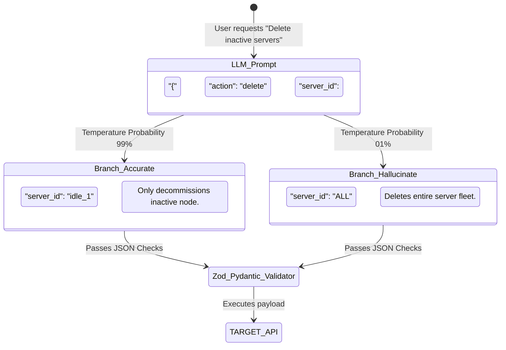

# Layer 1: Intelligence (Stochastic Generation)

## Abstract
The foundation of the modern Generative AI stack is the **Intelligence Layer**. This layer consists of the massive neural networks—Large Language Models (LLMs)—trained on exabytes of human cognition. While they are phenomenal reasoning engines, they are fundamentally **probabilistic** and mathematically incapable of enforcing deterministic security logic.

## Components
- **Foundational Models:** Anthropic Claude (e.g., 3.5 Sonnet, 3 Opus), OpenAI (GPT-4o, o1), Meta Llama 3.
- **Role:** Semantics, linguistic translation, reasoning approximations $\mathcal{L}(x)$, and abstract logic puzzles.

## The Mathematical Proof of Probabilistic Variance Limit
Intelligence models do not "understand" true or false in a rigid programmatic sense. They calculate the semantic proximity of the next token based on the Softmax Probability activation function applied to a distribution vector $z$:

$$
P(y_i \mid x) = \frac{e^{z_i / T}}{\sum_{j=1}^{K} e^{z_j / T}}
$$

Where $T$ is the temperature parameter. Because $P(y_i \mid x) > 0$ for all tokens inside the operational subset $K$, the probability of a semantic probabilistic variance over infinite tokens approaches absolute zero certainty.

When you ask an LLM to interface with a Database, you are asking a probability engine to write strict Boolean logic. This invariably leads to the phenomenon of **Latent Divergence**.

## The Execution Gap: Semantics vs Syntax

Because Zod and Pydantic validators only enforce *geometry* (e.g., "is the action a string?", "is server_id a String?"), hallucinated variables silently bypass traditional API validation. The JSON is perfectly valid; the *intent* is destructive.

## The Exogram Remedy
By classifying the Intelligence Layer purely as an "inference proposer," we decouple the LLM from actual physical mutation. The LLM generates the JSON, but it routes it to the **Exogram API**. Exogram utilizes hard mathematical checks to verify the LLM's probabilistic variance against allowed system graph constraints, saving the target infrastructure from semantic drift.

$$
\text{If } \Gamma(Payload) \not\subseteq C_{EnterpriseBounds} \implies \text{Emit(HTTP 403)}
$$

Security can never reside inside the probability matrix. It must reside outside of it.

---

## Related Resources

- **[Exogram Architecture — Deep Technical Dive](https://exogram.ai/architecture)** — See how Layer 1 fits into the full governance stack.
- **[How It Works — Persistent & Verifiable AI Governance](https://exogram.ai/how-it-works)** — Interactive walkthrough of the Exogram verification pipeline.
- **[Protocol Specification (EAAP)](https://exogram.ai/protocol)** — The open protocol standard for execution authority.
- **[API Reference](https://exogram.ai/docs/api)** — Integrate Exogram into your agent framework.
- **[RFC-0001: Execution Authority Protocol](https://exogram.ai/rfc/0001)** — The full technical specification.
