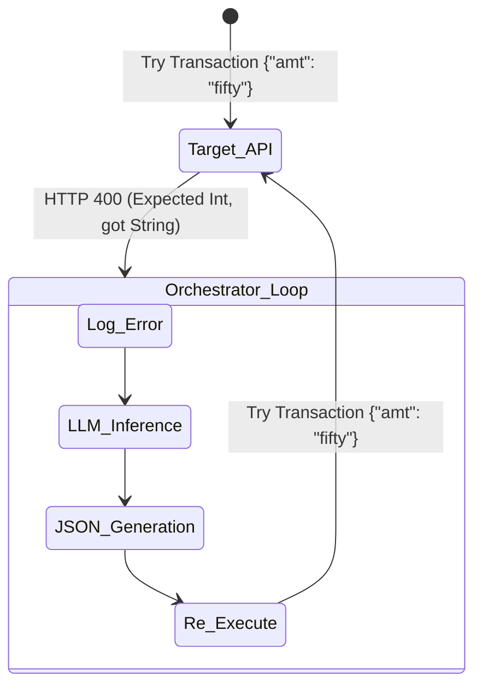

# Layer 3: Orchestration (Routing & Cyclic Loops)

## Abstract
Because LLMs cannot natively run Python or JavaScript on their own servers, the **Orchestration Layer** was developed to construct the actual agentic wrappers. This layer passes the text context to the Intelligence layer, receives the JSON string output, maps it to a local function tool, executes it, and sends the result back to the LLM.

## Components
- **Frameworks:** LangChain, CrewAI, AutoGen, Letta.
- **Role:** Finite State Machine management and loop routing $O_{state} \to O_{next\_state}$.

## The Execution Gap: Turing Completeness Vulnerability
Orchestration frameworks are incredibly powerful integration utilities, but they are architecturally incapable of acting as security boundaries. 

Any LangChain or AutoGen routing loop is inherently a Turing Complete execution graph. Because they grant the `Agent` the authority to determine what state it should transition to next via probability, they are subservient to probabilistic variance. A widely exploited vulnerability in Multi-Agent workflows is the **Recursive Death Spiral**.

### The Recursive $While$ Loop
If an LLM hallucinates an invalid string into an Integer API parameter, the Target API will reject it. LangChain's built-in tool error behavior is to throw the error back to the LLM and ask it to "fix it."

Because the LLM relies on stochastic memory, it often generates the exact same hallucinated parameter sequentially.

As the number of recursively failed loops approach infinity $n \to \infty$, the Orchestrator will literally burn through enterprise cloud budgets, API quotas, and memory footprints. Orchestrators lack network-edge physical isolation from the Agent running inside them, meaning they cannot stop their own recursive loops.

## The Exogram Remedy
The Exogram API tracks agent execution flows using a stateless Cryptographic Ledger. By offloading tool routing safely through the Exogram SDK, the Exogram node mathematically bounds the recursion asymptote:

$$
\forall P \in \mathcal{T}, \text{If } \lim_{n \to \text{Threshold}} \text{Count}(P_{hash} \mid L[A_{id}]) \implies \text{Emit}(HTTP\_429)
$$

Before LangChain can burn $5,000 hitting Stripe's API with an infinite retry-loop, Exogram severs the HTTP connection at the network edge with an `HTTP 429 Too Many Requests` or `HTTP 409 Conflict`, mathematically neutralizing the death-loop logic block.
