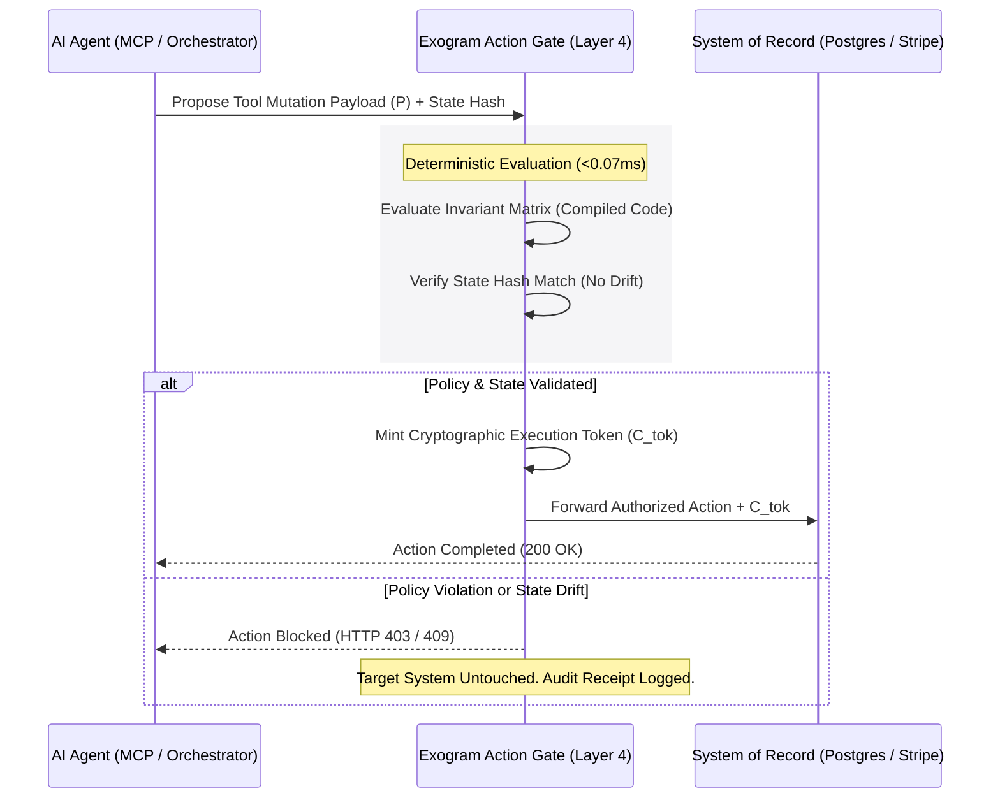

# Layer 4: Systems of Record & Verified Action Boundaries

> ### ⚡ The 2-Second Summary
> Language models should never hold direct write access to your database or bank account. **Layer 4** acts as a sub-millisecond safety gate that tests proposed actions against strict policy rules in compiled code before anything is committed.

---

## Abstract
For an AI system to move beyond passive conversation and perform real work, it must enact side-effects in systems of record: writing database rows, updating CRM tickets, sending messages, or invoking financial APIs. Layers 1 through 3 parse reasoning, manage connectors, and retrieve persistent memory, but probabilistic models cannot safely hold direct write authority.

**Layer 4** defines the **Verified Action Boundary**: a deterministic, compiled evaluation gate that validates proposed tool executions in **0.07ms** before any payload touches downstream systems.

---

## The Execution Gap (Probabilistic Guessing vs. Deterministic State)

Without Layer 4, an AI orchestrator connects an LLM directly to downstream APIs (PostgreSQL, Stripe, GitHub, AWS). If an attacker injects a malicious prompt, or if the model hallucinates incorrect SQL syntax or invalid parameters, the database executes it with the full privileges of the service account. The result is catastrophic data corruption, financial leakage, or system downtime.

System prompt instructions (*"Do not delete production tables"*) fail because prompt instructions are probabilistic tokens, not physical gates. If the model suffers an execution variance, prompt guardrails are bypassed entirely.

---

## The Deterministic Solution: Action Boundaries

The Exogram Protocol mandates that every state-mutating tool call MUST pass through a deterministic verification gate, structurally isolated from probabilistic model inference:

```
┌─────────────────────────────────────────┐
│  AI Model Proposes Action Payload (P)   │
└────────────────────┬────────────────────┘
                     │
                     ▼
┌─────────────────────────────────────────┐
│  Exogram Action Verification Gate       │
│  • Boolean Invariant Matrix (< 0.07ms)  │
│  • State Hash Binding H(S_context)      │
│  • Bounded Autonomy Limits              │
└────────────────────┬────────────────────┘
                     │
         ┌───────────┴───────────┐
         ▼                       ▼
    [ AUTHORIZED ]          [ REJECTED ]
   Mint Signed Token     Emit HTTP 403 / 409
   Forward to Database   Return Diagnostic
```

### The Invariant Evaluation Matrix

Let $\mathcal{T}$ denote the set of proposed tool parameters. Exogram computes a Boolean invariant matrix mapping payload intent against verified policy constraints:

$$
\forall P \in \mathcal{T}, \quad \mathbf{Execute}(P) \iff \left( \mathcal{H}(S_{target}) = \mathcal{H}(S_{context}) \right) \land \left( \Gamma(P) \subseteq C_{bounded} \right)
$$

Where:
- $\Gamma(P)$ represents the parameter claims extracted from the payload.
- $C_{bounded}$ represents the allowed operational policy envelope for the user or agent.
- $\mathcal{H}(S_{context})$ is the SHA-256 hash of the memory state at evaluation time.
- $\mathcal{H}(S_{target})$ is the SHA-256 hash at commit time, preventing Time-of-Check to Time-of-Use (TOCTOU) desynchronization.

The verification gate executes this evaluation in less than **0.07ms** on modern server hardware (AMD EPYC, Apple Silicon, AWS Graviton), adding zero perceptible latency to tool execution.

---

## Sequence Flow: Action Authorization



---

## Key Guarantees

1. **Zero LLM in Safety Critical Path:** Policy evaluation uses deterministic boolean logic in compiled code, completely eliminating secondary model hallucinations.
2. **State Hash Idempotency:** Mutations cannot execute against stale or modified memory states.
3. **Audit Provenance:** Every approval and rejection is appended to an immutable SHA-256 chained ledger for forensic review.
4. **Emergency Action Lock:** Users can freeze all pending and future state mutations across their workspace with a single toggle.

---

## Related Specifications

- [RFC 0001: Persistent Memory, Epistemic Grounding & Action Authorization](../0001-exogram-protocol-specification.md)
- [Layer 2: Memory Vaults & The Cognitive Filter](cognitive-filter.md)
- [Synthesis: The Complete 4-Layer Personal AI Stack](synthesis-the-full-stack.md)
