# Layer 4: Execution Authority (AI Agent Firewall)

## Abstract
For a machine to be truly autonomous, it must have the ability to enact side-effects in the physical world (spend money, delete rows, adjust thermostats). Layers 1 through 3 exist to parse reasoning, retrieve context, and establish agentic workflows, but they are absolutely incapable of deploying deterministic mathematical boundaries on execution.

The **Fourth Layer**, natively defined by the Exogram Protocol, introduces the **Execution Authority**. 

## The Execution Gap (Zero-Trust Mutation)
Without Layer 4, an enterprise connects an Orchestrator (LangChain) directly to their Target Environment (PostgreSQL/AWS). If an attacker prompt-injects the Orchestrator, or if the underlying LLM simply hallucinates bad Python syntax into an API call, the database receives it exactly like a human administrator executing a script. The risk of data loss or financial destruction is mathematical certainty.

## The Fourth Layer: The Mathematically Proven Solution
The Exogram Protocol mandates that all API/Tool payloads generated by the Orchestrator MUST pass through a physical proxy/SDK node, structurally isolated from the probabilistic routing container.

### The Cryptographic Admissibility Gate Math
Let $\mathcal{T}$ denote the set of all generated tool parameters. Exogram establishes a Boolean matrix calculation mapping Payload Intent against Enterprise Constraint vectors.

$$
\mathbf{M}_{intent} \times \mathbf{V}_{policy} = 
\begin{bmatrix}
i_{11} & i_{12} \\
i_{21} & i_{22} \\
\end{bmatrix}
\begin{bmatrix}
p_{1} \\
p_{2} \\
\end{bmatrix}
= \text{Authorization Subgraph } ( \Gamma(P) )
$$

$$
\forall P \in \mathcal{T}, \quad Execute(P) \iff \left( \mathcal{H}(S_{target}) = \mathcal{H}(S_{context}) \right) \land \left( \Gamma(P) \subseteq C_{bounded} \right)
$$

The Execution Authority intercepts the payload and computes these mathematical matrix comparisons in less than $0.07\text{ms}$. 

If the intent is valid, the Fourth Layer physically mints a **Cryptographic Execution Token** ($C_{tok}$ JWT) and attaches it to the HTTP request hitting the database. The Target Environment now knows exactly *which* intent was verified, isolating the transaction using **Intent-Based Permissioning (IBP)**.

### The Network Intercept Flow Diagram

```mermaid
sequenceDiagram
    participant Agent as LangChain Agent
    participant Firewall as Exogram Execution API
    participant JWT_Node as Target Environment (AWS)
    
    Agent->>Firewall: Emits Probabilistic Mutation Payload
    
    rect rgb(26, 26, 46)
        Note over Firewall: Cryptographic Gate Simulation
        Firewall->>Firewall: Matrix Computation M x V  < 0.07ms
        Firewall->>Firewall: Calculate Transient Intent Subgraph
    end
    
    alt Mathematics Validate Payload Intent
        Firewall->>Firewall: Mint C_TOK JWT with Millisecond TTL
        Firewall->>JWT_Node: Safe HTTP Forward + C_TOK
        JWT_Node-->>Agent: Mutated State (200 OK)
    else Matrix Execution Blocked (Probabilistic Variance)
        Firewall-->>Agent: Hard HTTP 403 / 409 Intercept
        Note over Agent: Physical World is Protected. Agent adjusts token generation.
    end
```

### The Autonomy Kill Switch
Because passing through Layer 4 is mathematically mandatory for physical infrastructure mutation, administrators can issue a $DropAll$ network signal instantly:

$$
\text{If } GlobalState = \text{LOCKED} \implies \forall P \in \mathcal{T}, Execute(P) = \mathbf{False}
$$

Because the Layer 4 architecture is physically external to the agentic processing loop, no prompt-injection or probabilistic variance can bypass the firewall block.

---

## Related Resources

- **[Protocol Specification (EAAP)](https://exogram.ai/protocol)** — The open protocol standard defining execution authority.
- **[RFC-0001: Execution Authority Protocol](https://exogram.ai/rfc/0001)** — Full technical specification with cryptographic proofs.
- **[How It Works — Persistent & Verifiable AI Governance](https://exogram.ai/how-it-works)** — Interactive walkthrough of the verification pipeline.
- **[Proving Ground — Live Demo](https://exogram.ai/proving-ground)** — Test execution authority in your browser.
- **[Security & Compliance](https://exogram.ai/security-and-compliance)** — SOC 2, HIPAA, and GDPR compliance details.
