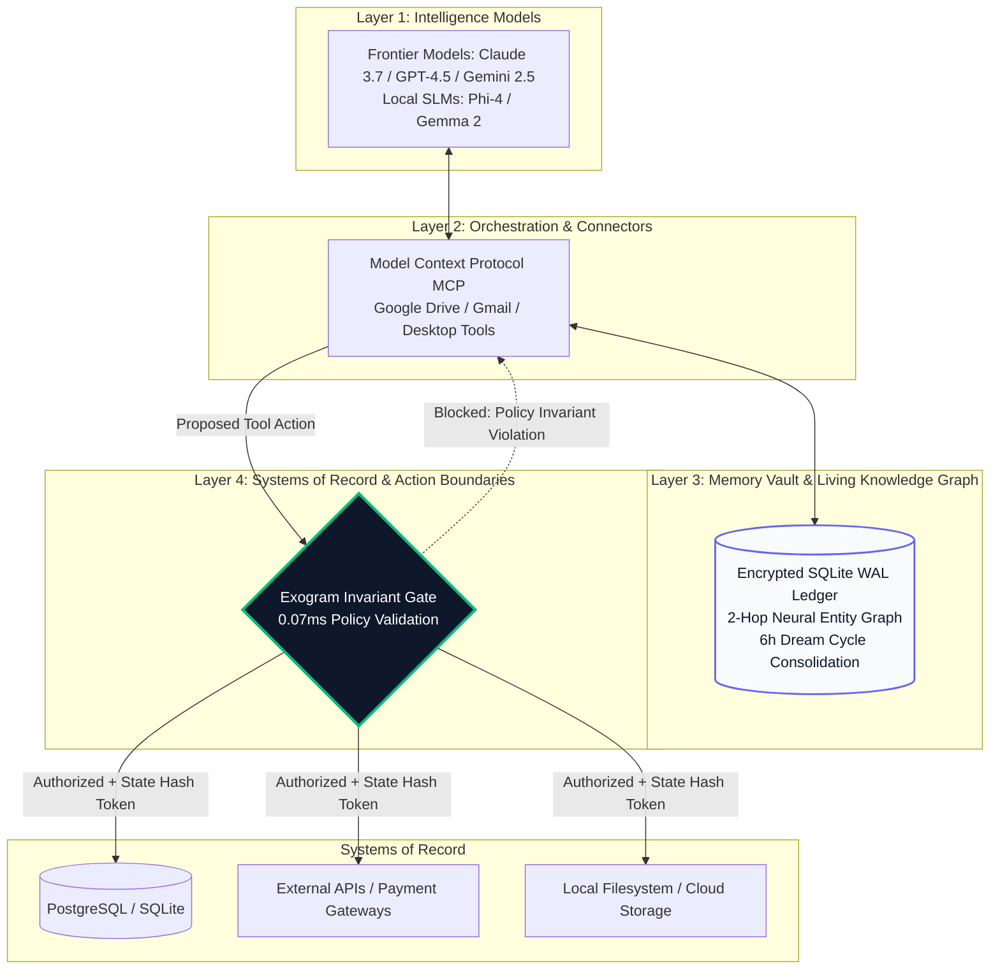

# Synthesis: The 4-Layer Personal AI Architecture

When all four layers of the Exogram processing stack are vertically integrated, they form a cohesive architecture that eliminates AI amnesia and enables reliable real-world execution.

---

## The System State Synthesis

The goal of governed personal AI is to ensure that generative, probabilistic models can think and synthesize freely, while state retention and real-world actions remain deterministic, grounded, and bounded.

We define total inference generation as the composition of model reasoning ($\mathcal{L}_{1}$), connector tool definitions ($\mathcal{C}_{2}$), and persistent memory graph retrieval ($\mathcal{M}_{3}$):

$$
\Psi_{total} = \mathcal{L}_{1} \circ \mathcal{C}_{2} \circ \mathcal{M}_{3}
$$

Because model reasoning is stochastic, $\Psi_{total}$ produces probabilistic hypotheses. The Exogram Protocol introduces the deterministic invariant evaluation function $\mathcal{G}_{eval}$ at Layer 4:

$$
\mathbf{State}_{committed} = \mathcal{G}_{eval}(\Psi_{total}) \in \{ \text{AUTHORIZED}, \text{BLOCKED} \}
$$

By passing proposed actions through this deterministic gate, the user's systems of record are insulated from model errors, hallucinations, and prompt injections.

---

## Architectural Synthesis Model

---

## Decoupled Responsibilities

| Layer | Component | Core Responsibility | Failure Mode Prevented |
| :--- | :--- | :--- | :--- |
| **Layer 1** | **Intelligence Models** | Reasoning, comprehension, synthesis, and creative planning. | Rigid, un-adaptive rule matching. |
| **Layer 2** | **Orchestration & Connectors** | Tool routing, UI interaction, standard MCP integrations. | Proprietary vendor lock-in. |
| **Layer 3** | **Memory Vault & Knowledge Graph** | Persistent fact recording, 2-hop graph reasoning, Dream Cycles. | Session amnesia & context drift. |
| **Layer 4** | **Systems of Record & Action Boundaries** | 0.07ms invariant gating, state hash binding, audit logging. | Runaway execution & data corruption. |

By separating probabilistic cognition from deterministic consequence, users can leverage the full intelligence of frontier models without risking unauthorized state changes or suffering from conversation amnesia.

---

## Related Documentation

- [RFC 0001: The Core Protocol Specification](../0001-exogram-execution-authority.md)
- [Layer 2: Memory Vaults & The Cognitive Filter](cognitive-filter.md)
- [Layer 4: Systems of Record & Verified Action Boundaries](layer-4-execution-authority.md)
- [Developer Tooling: Python SDK & MCP Guide](developer-agent-tooling.md)
